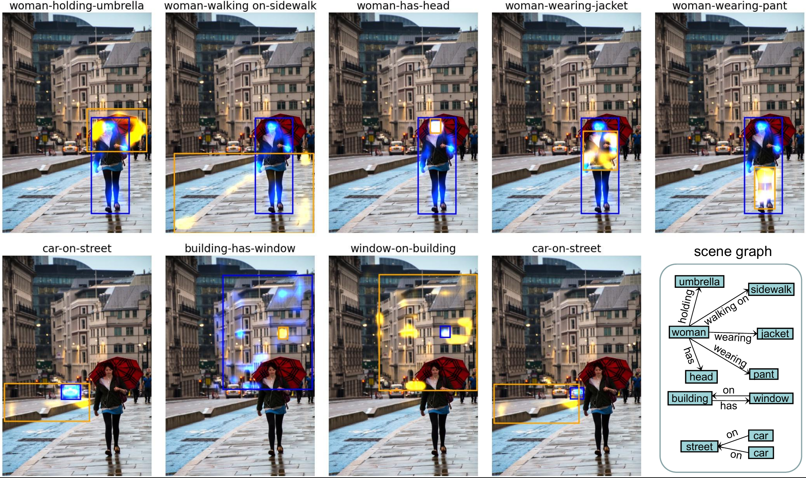
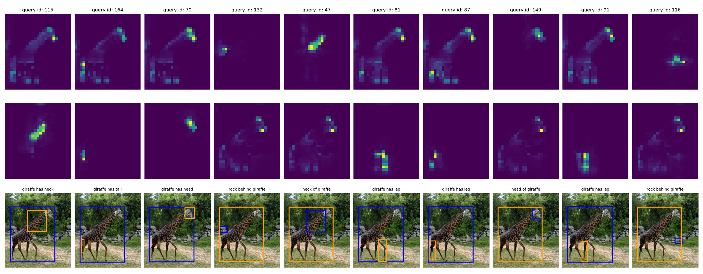

:tada: Good News: our work has been accepted by **IEEE Transactions on Pattern Analysis and Machine Intelligence (PAMI)!** :tada:

[](https://colab.research.google.com/drive/1-U642OoCyb8OSM8nx9lme49dmWa_aUcU?usp=sharing)
# RelTR: Relation Transformer for Scene Graph Generation

We now provide [[Colab](https://colab.research.google.com/drive/1-U642OoCyb8OSM8nx9lme49dmWa_aUcU?usp=sharing)] Demo! 

PyTorch Implementation of the Paper [**RelTR: Relation Transformer for Scene Graph Generation**](https://arxiv.org/abs/2201.11460v3)

Different from most existing advanced approaches that infer the **dense** relationships between all entity proposals, our one-stage method can directly generate a **sparse** scene graph by decoding the visual appearance. If our work is helpful for your research, please cite our publication:
```
@article{cong2023reltr,
  title={Reltr: Relation transformer for scene graph generation},
  author={Cong, Yuren and Yang, Michael Ying and Rosenhahn, Bodo},
  journal={IEEE Transactions on Pattern Analysis and Machine Intelligence},
  year={2023},
  publisher={IEEE}
}
```

<p align="center">
  
</p>

# 0. Checklist

- [x] Inference Code :tada:
- [x] Training Code for Visual Genome :tada:
- [x] Evaluation Code for Visual Genome :tada:
- [x] Colab Demo :tada:
- [x] Training Code for OpenImages V6 :tada:
- [x] Evaluation Code for OpenImages V6 :tada:
- [ ] Cleaner Evaluation Code :clock9:
- [ ] Post Processing :clock9:


# 1. Installation
Download **RelTR Repo** with:
```
git clone https://github.com/yrcong/RelTR.git
cd RelTR
```

## For Inference
:smile: It is super easy to configure the RelTR environment.

If you want to **infer an image**, only python=3.6, PyTorch=1.6 and matplotlib are required!
You can configure the environment as follows:
```
# create a conda environment 
conda create -n reltr python=3.6
conda activate reltr

# install packages
conda install pytorch==1.6.0 torchvision==0.7.0 cudatoolkit=10.1 -c pytorch
conda install matplotlib
```

## Training/Evaluation on Visual Genome or Open Images V6
If you want to **train/evaluate** RelTR on Visual Genome, you need a little more preparation:

a) Scipy (we used 1.5.2) and pycocotools are required. 
```
conda install scipy
pip install -U 'git+https://github.com/cocodataset/cocoapi.git#subdirectory=PythonAPI'
```
b) Follow [README](https://github.com/yrcong/RelTR/blob/main/data/README.md) in the data directory to prepare the datasets.

c) Some widely-used evaluation code (**IoU**) need to be compiled... We will replace it with Pytorch code.
```
# compile the code computing box intersection
cd lib/fpn
sh make.sh
```

The directory structure looks like:
```
RelTR
| 
│
└───data
│   └───vg
│       │   rel.json
│       │   test.json
│       |   train.json
|       |   val.json
|       |   images
│   └───oi
│       │   rel.json
│       │   test.json
│       |   train.json
|       |   val.json
|       |   images
└───datasets    
... 
```

# 2. Usage

## Inference
a) Download our [RelTR model](https://drive.google.com/file/d/1id6oD_iwiNDD6HyCn2ORgRTIKkPD3tUD/view) pretrained on the Visual Genome dataset and put it under 
```
ckpt/checkpoint0149.pth
```
b) Infer the relationships in an image with the command:
```
python inference.py --img_path $IMAGE_PATH --resume $MODEL_PATH
```
We attached 5 images from **VG** dataset and 1 image from **internet**. You can also test with your customized image. The result should look like:
<p align="center">
  
</p>

## Training
a) Train RelTR on Visual Genome on a single node with 8 GPUs (2 images per GPU):
```
python -m torch.distributed.launch --nproc_per_node=8 --use_env main.py --dataset vg --img_folder data/vg/images/ --ann_path data/vg/ --batch_size 2 --output_dir ckpt
```
b) Train RelTR on Open Images V6 on a single node with 8 GPUs (2 images per GPU):
```
python -m torch.distributed.launch --nproc_per_node=8 --use_env main.py --dataset oi --img_folder data/oi/images/ --ann_path data/oi/ --batch_size 2 --output_dir ckpt
```

## Evaluation
a) Evaluate the pretrained [RelTR](https://drive.google.com/file/d/1id6oD_iwiNDD6HyCn2ORgRTIKkPD3tUD/view) on Visual Genome with a single GPU (1 image per GPU):
```
python main.py --dataset vg --img_folder data/vg/images/ --ann_path data/vg/ --eval --batch_size 1 --resume ckpt/checkpoint0149.pth
```

b) Evaluate the pretrained [RelTR](https://drive.google.com/file/d/1pcoUnR0XWsvM9lJZ5f93N5TKHkLdjtnb/view?usp=share_link) on Open Images V6 with a single GPU (1 image per GPU):
```
python main.py --dataset oi --img_folder data/oi/images/ --ann_path data/oi/ --eval --batch_size 1 --resume ckpt/checkpoint0149_oi.pth
```

# 3. Questions
Since the code is cleaned up from the draft, there may be some errors.
If you meet any problem when running our code, please let me know! (It's better open an issue so that anyone can see it)
